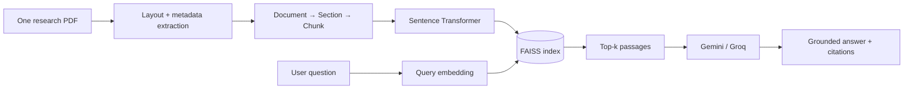

# PaperLens — Research Paper Analyzer

A focused, defensible retrieval-augmented generation (RAG) project. Upload one research PDF, inspect its detected structure, ask questions, and receive answers grounded in passages with explicit page citations.

## What is genuinely implemented

- Single-PDF replacement workflow and page-aware text extraction with PyMuPDF
- Font-size, bold-style, numbering, and common-heading based section detection
- `Document → Section → Chunk` hierarchy persisted alongside the vector index
- Overlapping chunking that preserves paper, page, section name, and section level
- Sentence Transformer embeddings stored in a FAISS cosine-similarity index
- Semantic retrieval within the uploaded paper
- Exact section listing, extraction, and extractive section-wise summaries
- Grounded answer generation using Gemini or Groq
- An extractive fallback when no LLM key is configured
- Clickable inline citations mapped to `Citation [n] — paper.pdf — Page n` source cards
- Deterministic title, author, page-count, and abstract answers that work without an LLM
- Automatic retry and Gemini/Groq failover for temporary 429/5xx provider errors
- Automated tests for chunking, retrieval, and citation metadata

## Architecture



Metadata (`paper`, `page`, `section_name`, `section_level`, `chunk_id`, and text) is stored beside the FAISS vectors and returned with every retrieval result.

## Project structure

```text
backend/
  app/api.py          FastAPI routes
  app/chunking.py     recursive overlapping chunker
  app/pdf.py          metadata, layout, and section extraction
  app/retrieval.py    embeddings, FAISS, persistence, search
  app/generation.py   Gemini/Groq prompting and fallback
  tests/              automated unit tests
frontend/
  src/                React interface
```

## Run locally

Requirements: Python 3.10+, Node 18+, npm.

### 1. Backend

```bash
cd backend
python -m venv .venv
source .venv/bin/activate          # Windows: .venv\\Scripts\\activate
pip install -r requirements.txt
cp ../.env.example ../.env
uvicorn app.api:app --reload --port 8000
```

The embedding model downloads on first run. Add either `GEMINI_API_KEY` or `GROQ_API_KEY` to `.env`. Without a key, the app still runs and returns the best retrieved passages as an explicitly labelled extractive answer.

### 2. Frontend

```bash
cd frontend
npm install
npm run dev
```

Open `http://localhost:5173`.

### 3. Tests

```bash
cd backend
pytest -q
```

Tests use a deterministic fake embedder, so they do not download a model or call an external API.

## API

| Method | Endpoint | Purpose |
|---|---|---|
| `POST` | `/api/documents` | Upload or replace the single PDF |
| `GET` | `/api/documents` | Inspect the indexed paper |
| `DELETE` | `/api/documents` | Clear the paper and index |
| `POST` | `/api/ask` | Retrieve passages and generate a cited answer |
| `GET` | `/health` | Health check |

## Design decisions worth explaining in an interview

- FAISS `IndexFlatIP` is used with L2-normalized embeddings, making inner product equivalent to cosine similarity.
- Chunk overlap reduces the chance that an answer-spanning sentence is split across boundaries.
- Exact structural questions bypass vector search; FAISS is reserved for semantic content questions.
- Narrowing the application to one paper avoids misleading cross-paper comparisons and produces a clearer portfolio story.
- Citation metadata is attached during extraction and never inferred by the LLM.
- Retrieved context is delimited and the prompt tells the model to use only that context and to admit insufficient evidence.
- Upload, retrieval, and generation are separate modules, which makes each unit testable and replaceable.

## Limitations

- Accepts text-based PDF files only; DOCX, URLs, HTML, scanned/image-only PDFs, password-protected PDFs, and OCR are outside this version.
- Heading detection is layout-aware but heuristic because publishers use inconsistent PDF structures.
- Embedded PDF metadata and first-page layouts vary, so author and affiliation extraction is labelled as extracted information rather than guaranteed bibliographic data.
- Tables, figures, equations, and reading order in complex multi-column layouts may not be reconstructed perfectly.
- Printed page labels may differ from the PDF page numbers shown by the application.
- The index is single-user and local; production multi-user use would require authentication and per-user storage.
- This version uses dense retrieval only. It does not claim hybrid BM25 retrieval or measured accuracy gains.
- Multi-paper comparison is intentionally not supported.

## Screenshots

After running the project, add screenshots to `docs/screenshots/` showing: (1) a detected paper and section count, (2) a cited answer with expanded citations, (3) section extraction, and (4) passing tests. This repository does not include fabricated screenshots.

## Resume wording

**PaperLens — Research Paper Analyzer** — Python, FastAPI, React, FAISS, Sentence Transformers, Gemini/Groq

- Built a section-aware RAG application for analysing research PDFs and answering document-grounded questions with page-level citations.
- Implemented layout-based heading detection and a persisted `Document → Section → Chunk` hierarchy before Sentence Transformer embedding and FAISS retrieval.
- Developed FastAPI and React interfaces for section extraction, semantic search, cited generation, and resilient LLM fallback, with automated tests for structure, chunking, retrieval, and citation metadata.
